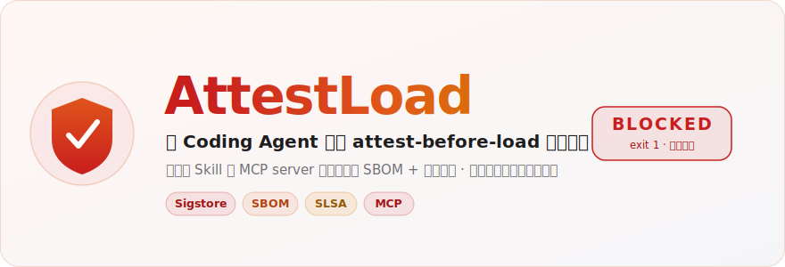
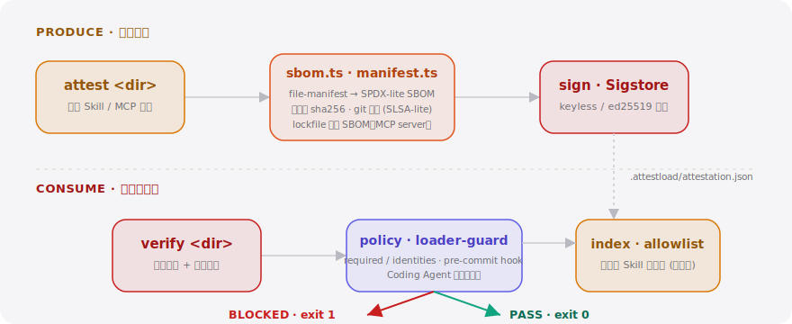

<div align="right"><sub><a href="./README.en.md">English</a>&nbsp;&nbsp;⇄&nbsp;&nbsp;<b>简体中文</b></sub></div>

<picture>
  <source media="(prefers-color-scheme: dark)" srcset="./assets/hero-dark.svg">
  <source media="(prefers-color-scheme: light)" srcset="./assets/hero-light.svg">
  
</picture>

<p><sub>AttestLoad 给每个 Skill 与 MCP server 装上可验证的 SBOM 与构建溯源签名，让 Coding Agent 在加载前拒绝任何未经签名的代码——信任从 star 数变成密码学事实。</sub></p>

<p align="center">
  <a href="./LICENSE"></a>
  <a href="https://github.com/SuperMarioYL/attestload/releases"></a>
  <a href="https://github.com/SuperMarioYL/attestload/actions/workflows/ci.yml"></a>
  
  
  
</p>

**你靠 star 数装了一个 Skill，却不知道它加载时会运行什么——AttestLoad 把这道信任缺口变成一次密码学校验：未签名或被篡改的代码，加载前一律拒绝。**

近期 "10k 个被植入木马的 GitHub 仓库" 的供应链事件提醒所有人：自主 Coding Agent 会按 star 数自动安装 Skill 和 MCP server，没有人真正读过那些代码。AttestLoad 把成熟的 SBOM / SLSA / Sigstore 供应链原语，第一次接到 **agent 加载 Skill 的那条路径**上——这是一个新动词：**attest-before-load**。

---

## 目录

- [架构](#架构)
- [安装](#安装)
- [快速开始](#快速开始)
- [用法](#用法)
- [Demo](#demo)
- [为什么需要它](#为什么需要它)
- [对比 cosign / Trivy](#对比-cosign--trivy)
- [配置](#配置)
- [路线图](#路线图)
- [定价](#定价)
- [许可证](#许可证)

---

<h2 id="架构"> 架构</h2>

单个 Node CLI，无服务、无数据库、无 Kubernetes；仅在签名/验签时访问公共 Sigstore（Fulcio / Rekor）。作者一侧 `attest` 产出签名清单，消费一侧 `verify` 在加载前校验，`policy` 与 `loader-guard` 决定放行还是拒绝。

<picture>
  <source media="(prefers-color-scheme: dark)" srcset="./assets/atlas-dark.svg">
  <source media="(prefers-color-scheme: light)" srcset="./assets/atlas-light.svg">
  
</picture>

新原语是**证明清单（attestation manifest）**——一个随 Skill / MCP 目录一起分发的签名包：

| 字段 | 含义 |
|---|---|
| `subject` | 名称 / 版本 / 目录 sha256 摘要 / SBOM 来源（`file-manifest` 或 `lockfile`） |
| `sbom` | SPDX-lite 包清单（Skill 即每文件条目；MCP server 来自 lockfile） |
| `files` | 内容寻址的逐文件清单（path · sha256 · size） |
| `provenance` | SLSA-lite 溯源（builder · source_repo · source_commit） |
| `signature` | Sigstore 包 + Rekor 日志索引（或 ed25519 本地签名兜底） |

<h2 id="安装"> 安装</h2>

需要 Node ≥ 22。

```bash
npm install -g attestload     # 或免安装：npx attestload <命令>
```

<h2 id="快速开始"> 快速开始</h2>

冷启动到第一次「拒绝瞬间」，三条命令：

```bash
git clone https://github.com/SuperMarioYL/attestload && cd attestload && npm install && npm run build
node dist/cli.js attest ./examples/signed-skill      # 签发证明（默认本地 ed25519）
node dist/cli.js verify ./examples/unsigned-skill    # BLOCKED，退出码 1 —— 这就是钩子
```

<details>
<summary>示例输出</summary>

```text
$ attestload attest ./examples/signed-skill
✓ attested
  subject : signed-skill@1.0.0 (skill)
  digest  : 1a72a17cf6a691f8249d73b5762ee0d513cf6e2e8e2a73c055e73e382948779e
  sbom    : file-manifest, 2 package(s)
  signing : ed25519
  written : ./examples/signed-skill/.attestload/attestation.json

$ attestload verify ./examples/signed-skill
PASS — verified
  built by local:you from local@no-commit · signed ed25519

$ attestload verify ./examples/unsigned-skill
BLOCKED: no attestation found at .attestload/attestation.json — refusing to load unattested code
  verdict: UNSIGNED (no-manifest)
  unattested code refused to load
# exit code: 1
```

</details>

<h2 id="用法"> 用法</h2>

四个子命令覆盖完整链路。每条命令都接受 `--json` 输出机器可读结果；`verify` 的退出码可直接用于 CI 与 git hook。

**签发（作者一侧）** —— 为 Skill 或 MCP server 目录派生 SBOM、捕获 git 溯源并签名：

```bash
attestload attest ./my-skill --kind skill          # 扁平 Skill，SBOM 来自文件清单
attestload attest ./my-mcp-server --kind mcp-server # 有 lockfile 时从 lockfile 派生
attestload attest ./my-skill --sigstore             # 强制 keyless Sigstore（一次浏览器 OIDC）
```

**校验（消费一侧）** —— 加载前的闸门，被篡改 / 未签名即拒绝：

```bash
attestload verify ./downloaded-skill                # PASS → exit 0，BLOCKED → exit 1
attestload verify ./downloaded-skill --policy attestload.policy.yaml
attestload verify ./downloaded-skill --allowlist    # 命中已验证白名单也放行（冷启动）
```

**白名单（冷启动）** —— 在作者尚未签名前，先用一份已验证的热门 Skill 名单兜底：

```bash
attestload index seed                               # 预置热门 Skill / MCP server
attestload index add my-skill --digest sha256:...   # 钉住期望摘要
attestload index list
```

**守卫** —— 在仓库里装一个 git pre-commit 钩子，提交前自动校验：

```bash
attestload guard install
```

更多可直接运行的示例见 [`examples/`](./examples)。

<h2 id="demo"> Demo</h2>

`verify` 拒绝一个未签名 Skill，随后放行同一个已签名 Skill —— 这一拒绝瞬间就是可分享的钩子。


<h2 id="为什么需要它"> 为什么需要它</h2>

如今选择一个 Skill / MCP server 的依据基本只有 star 数，而自主 agent 会跳过人工审阅直接自动安装——这正是供应链攻击的理想入口。AttestLoad 把每一份产物的信任从「社交证明」换成「密码学事实」：摘要 + 签名 + 溯源在加载前一次校验，这是唯一能随 agent 集群规模扩展的办法。

<h2 id="对比-cosign--trivy"> 对比 cosign / Trivy</h2>

诚实定位：通用工具更成熟，AttestLoad 的差异在于把这套原语接到了 **agent 加载 Skill 的那条路径**上。

| 能力 | AttestLoad | cosign | Trivy |
|---|:---:|:---:|:---:|
| 加载前对 Skill / MCP 目录「拒绝加载」 | ✓ | — | — |
| 随产物分发的内容寻址 SBOM | ✓ | partial | ✓ |
| keyless Sigstore + Rekor 签名 | ✓ | ✓ | — |
| 通用容器镜像 / OCI 工件签名 | — | ✓ | partial |
| 成熟度 / 生态广度 | 早期 | 成熟 | 成熟 |

要给容器镜像签名，用 cosign；要扫 CVE，用 Trivy。要让 **Coding Agent 在加载一个 Skill 前拒绝未经证明的代码**——这个动词目前只有 AttestLoad。

<h2 id="配置"> 配置</h2>

`verify` 会就近读取一个可选的 `attestload.policy.json` / `.yaml`；缺省即严格策略。

| 键 | 类型 | 默认 | 含义 |
|---|---|---|---|
| `require_provenance` | bool | `true` | 缺少溯源即拒绝 |
| `require_signature` | bool | `true` | 缺少有效签名即拒绝 |
| `allowed_identities` | string[] | `[]` | 允许的签名身份（OIDC 标识，空表示不限制） |
| `use_allowlist` | bool | `false` | 命中已验证白名单也放行（冷启动） |

<h2 id="路线图"> 路线图</h2>

- [x] **m1** —— `attest` 把 Skill / MCP 目录签成可验证的 SBOM + 溯源清单
- [x] **m2** —— `verify` 拒绝未签名 / 被篡改产物，放行已签名产物（拒绝 demo）
- [x] **m3** —— `index` 维护已验证 Skill 白名单，解决冷启动
- [ ] 托管团队层：持续更新的已验证 Skill 白名单 + 组织级策略执行（见[定价](#定价)）
- [ ] 在 awesome-mcp-servers 等热门目录落地参考集成
- [ ] 面向更多 agent runtime 的加载守卫适配

<h2 id="定价"> 定价</h2>

开源 CLI（本仓库）开放可用，覆盖本地的 attest / verify / 白名单全流程。当一支团队需要把校验从「每台电脑各管各的」升级为「全组织统一执行」时，托管层接管：

| 层级 | 价格 | 内容 |
|---|---|---|
| **OSS CLI** | 开放使用 | 本地 attest / verify / 本地白名单 · git pre-commit 守卫 |
| **托管团队层** | **$199 / 月**（含 10 席） | 持续更新的已验证 Skill 白名单 + 组织级策略执行（CI / pre-commit 服务，统一管控 agent 集群可自动安装哪些 Skill）+ 每次证明决策的审计轨迹 |
| **席位扩展** | **$15 / 席 / 月** | 超出 10 席部分 |
| **企业层** | **~$2k / 年** | SSO + 审计 + 设计合作支持 |

最短的「我要刷卡」路径：免费 CLI 在本地证明 refuse-then-pass 的价值 → 团队意识到需要全组织强制 → 托管面板给出一个白名单 URL + 一个 Stripe Checkout 链接，粘进 pre-commit / CI 配置，10 分钟内集群即受控。前三家设计合作团队由我们手动接入。

<h2 id="许可证"> 许可证 & 参与贡献</h2>

MIT，见 [LICENSE](./LICENSE)。欢迎提 [Issue](https://github.com/SuperMarioYL/attestload/issues) 或 PR——尤其欢迎为某个 Skill / MCP server 仓库补上一份 `attestload.manifest.json` 的参考集成。

推送后建议设置仓库 topics：`gh repo edit --add-topic mcp --add-topic coding-agent --add-topic skill --add-topic sbom`

## Share this

```text
AttestLoad — the attest-before-load gate for coding agents. Sign your Skill / MCP server into a verifiable SBOM, and the agent refuses unsigned code before it loads. Trust stops being star count. https://github.com/SuperMarioYL/attestload
```

---

<p align="center"><sub><a href="./LICENSE">MIT</a> © 2026 SuperMarioYL</sub></p>
