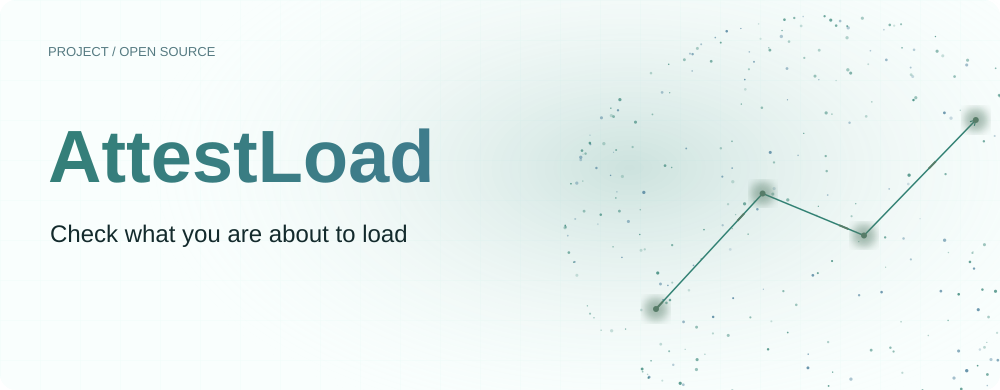
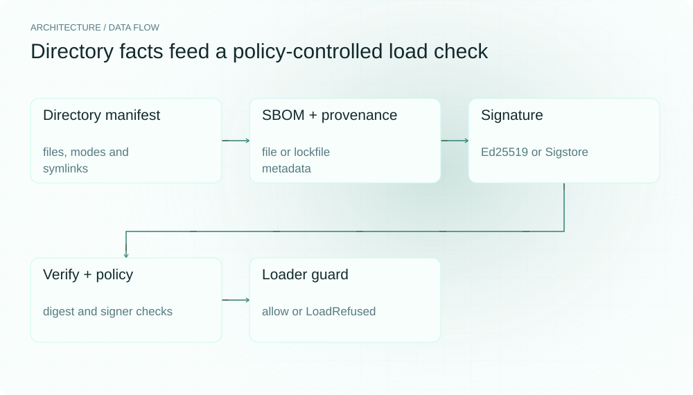
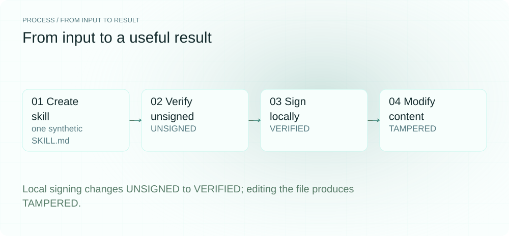
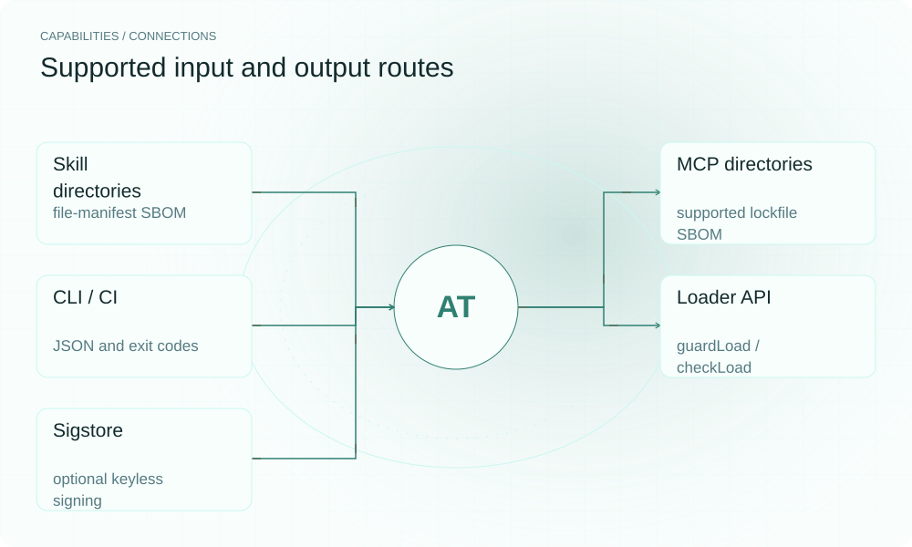

[English](./README.en.md) · [Website](https://attestload.lei6393.com) · [GitHub](https://github.com/SuperMarioYL/attestload)

<picture>
  <source media="(max-width: 600px) and (prefers-color-scheme: dark)" srcset="./assets/presentation/hero-mobile-dark.svg">
  <source media="(max-width: 600px)" srcset="./assets/presentation/hero-mobile-light.svg">
  <source media="(prefers-color-scheme: dark)" srcset="./assets/presentation/hero-dark.svg">
  
</picture>

# AttestLoad

**加载前，核对代码与签名**

AttestLoad 为目录清单签名，并在加载前核对文件。可在 CI 中运行 CLI，也可由掌握加载入口的应用调用 guardLoad。

## 为什么需要它

目录内容可能在审查和安装之间发生变化。签名清单记录文件集合，验证过程发现内容变更，策略则决定工作流接受哪些签名身份。

- **内容校验** — 验证时重新检查文件摘要、可执行权限和符号链接元数据。
- **明确签名模式** — 本地 Ed25519 与需要联网的 Sigstore 签名明确区分。
- **加载入口决策** — 校验或策略拒绝产物时，guardLoad 抛出 LoadRefused。

## 架构

<picture>
  <source media="(max-width: 600px) and (prefers-color-scheme: dark)" srcset="./assets/presentation/architecture-mobile-dark.svg">
  <source media="(max-width: 600px)" srcset="./assets/presentation/architecture-mobile-light.svg">
  <source media="(prefers-color-scheme: dark)" srcset="./assets/presentation/architecture-dark.svg">
  
</picture>

manifest.ts 将文件整理为带摘要的清单，sbom.ts 提取文件级或支持的锁文件元数据，attest.ts 加入来源信息并为规范化 JSON 签名。verify.ts 重新计算内容并验签，policy.ts 检查来源和绑定的签名身份，loader-guard.ts 向调用方提供结果。

| 组件 | 职责 |
| --- | --- |
| `Directory manifest` | files, modes and symlinks |
| `SBOM + provenance` | file or lockfile metadata |
| `Signature` | Ed25519 or Sigstore |
| `Verify + policy` | digest and signer checks |
| `Loader guard` | allow or LoadRefused |

## 安装与快速上手

需要 Node.js 22+。记录示例将临时签名密钥放在被签目录之外。

```bash
git clone https://github.com/SuperMarioYL/attestload.git
cd attestload
npm ci
npm run build
```

完整示例创建临时 Skill 和密钥，使用本地 Ed25519 签名、验证，再修改文件。不调用 Fulcio 或 Rekor。

```bash
node examples/presentation-demo.mjs
```

## 实际运行示例

<picture>
  <source media="(max-width: 600px) and (prefers-color-scheme: dark)" srcset="./assets/presentation/process-mobile-dark.svg">
  <source media="(max-width: 600px)" srcset="./assets/presentation/process-mobile-light.svg">
  <source media="(prefers-color-scheme: dark)" srcset="./assets/presentation/process-dark.svg">
  
</picture>

Local signing changes UNSIGNED to VERIFIED; editing the file produces TAMPERED.

```text
unsigned: UNSIGNED
signing mode: ed25519
signed: VERIFIED
modified: TAMPERED
Scope: local Ed25519 integrity checks; no Sigstore network or trusted-publisher assertion.
```

完整命令与输出保存在 [docs/demo-results.json](./docs/demo-results.json). 输入和复现代码均随仓提供。

## 用法

attest 将 .attestload/attestation.json 写在目录中。verify 在策略接受时返回 0，被拒绝时返回 1，未签名示例应被拒绝。应用可从 attestload 导入 guardLoad，在执行或导入目录代码之前 await；checkLoad 返回决策而不抛异常。

```bash
node dist/cli.js attest ./examples/signed-skill --kind skill
node dist/cli.js verify ./examples/signed-skill --json
node dist/cli.js verify ./examples/unsigned-skill --json
```

## 配置

策略支持 require_provenance、require_signature、allowed_identities 和 use_allowlist。Ed25519 身份使用 ed25519:<SPKI-DER SHA-256> 固定；Sigstore 身份来自已验证证书的 SAN。未限制 allowed_identities 时，有效的自签本地密钥并不能证明可信发布者。冷启动白名单要求现有完整但未签名的清单，以及匹配的固定产物摘要；仅名称不够。--sigstore 需要可用 OIDC Token 和网络，默认签名可能回退到本地 Ed25519。

```yaml
require_provenance: true
require_signature: true
allowed_identities: []
use_allowlist: false
```

## 集成与职责分工

<picture>
  <source media="(max-width: 600px) and (prefers-color-scheme: dark)" srcset="./assets/presentation/integrations-mobile-dark.svg">
  <source media="(max-width: 600px)" srcset="./assets/presentation/integrations-mobile-light.svg">
  <source media="(prefers-color-scheme: dark)" srcset="./assets/presentation/integrations-dark.svg">
  
</picture>

只有应用或 CI 主动调用并遵循验证结果，才能在加载前形成检查。工具不会自动拦截所有 Agent。SPDX-lite 和 SLSA-lite 表示本仓库的精简元数据格式，不代表完整标准认证。

| 路径 | 已实现职责 |
| --- | --- |
| Skill directories | file-manifest SBOM |
| MCP directories | supported lockfile SBOM |
| CLI / CI | JSON and exit codes |
| Loader API | guardLoad / checkLoad |
| Sigstore | optional keyless signing |

## 限制与后续方向

- 签名有效和内容完整不等于代码无害，仍需审查 Skill 能执行的行为。
- 示例仅验证本地签名，没有运行 Sigstore 透明日志和身份流程。
- 如果调用方没有控制检查到执行之间的边界，检查通过后文件仍可能变化。

仓库提供本地签名与验证、签名者策略、白名单管理和加载 API。更多运行时适配器和团队策略分发仍属后续方向，本仓库没有演示托管订阅服务。实现变更见 CHANGELOG.md。

## 许可与贡献

许可见 [LICENSE](./LICENSE). 反馈问题时请提供最小输入、执行命令和实际输出。
